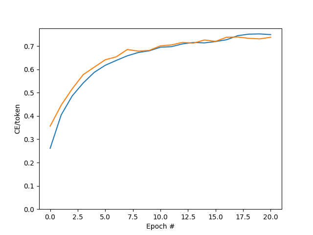

# Neural Machine Translation with Attention

- It is practice project adapted from [Tensorflow version](https://www.tensorflow.org/text/tutorials/nmt_with_attention).
- Dataset is taken from [Anki](http://www.manythings.org/anki/). As in Tensorflow tutorial, I also worked with Spanish-English dataset.
- Implemented using:
  - Python 3.10.6
  - Tensorflow 2.11.0
  - Matplotlib 3.6.3

- Accuracy graph:

  

- Loss graph:

  